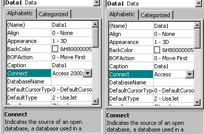

<div align="center">

## Solving "Could not find Installable ISAM" error


</div>

### Description

How to avoid / solve the "could not find installable ISAM error" in VB
 
### More Info
 


<span>             |<span>
---                |---
**Submitted On**   |
**By**             |[Cybsoft](https://github.com/Planet-Source-Code/PSCIndex/blob/master/ByAuthor/cybsoft.md)
**Level**          |Beginner
**User Rating**    |4.3 (13 globes from 3 users)
**Compatibility**  |VB 5\.0, VB 6\.0
**Category**       |[Coding Standards](https://github.com/Planet-Source-Code/PSCIndex/blob/master/ByCategory/coding-standards__1-43.md)
**World**          |[Visual Basic](https://github.com/Planet-Source-Code/PSCIndex/blob/master/ByWorld/visual-basic.md)
**Archive File**   |[](https://github.com/Planet-Source-Code/cybsoft-solving-could-not-find-installable-isam-error__1-40142/archive/master.zip)


### Source Code

```
Ever got the "ISAM-error" and dit not know what to do ? Try finding info on this error and the puzzle gets bigger and bigger but the solution is simple !
De error occures when you are using a different version ACCESS than the original coder did so the "connect" property of the data-control is set wrong.
Just set it ot the correct one and... ISAM error is gone (look at screendump)
(Dont know if this works for EXCEL)
```

